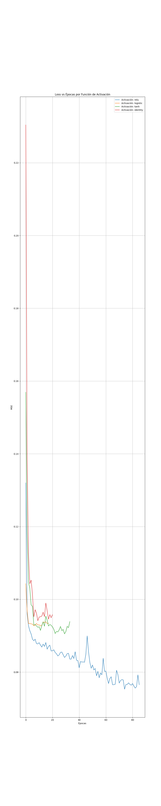

# Predicción de Costos Médicos mediante Redes Neuronales Artificiales

## Descripción

Este proyecto explora el uso de redes neuronales artificiales para la predicción de costos médicos utilizando el algoritmo `MLPRegressor` de Scikit-Learn.

El objetivo principal es analizar el desempeño de distintas funciones de activación dentro de una red neuronal multicapa y evaluar su capacidad para aproximar la relación entre variables demográficas y el costo asociado a servicios médicos.

---

## Objetivos

- Implementar una red neuronal multicapa para un problema de regresión.
- Analizar el efecto de distintas funciones de activación sobre el desempeño del modelo.
- Comparar métricas de error obtenidas durante el entrenamiento y evaluación.
- Aplicar técnicas de preprocesamiento de datos para mejorar el aprendizaje de la red.

---

## Dataset

Se utilizó el conjunto de datos **Medical Cost Personal Dataset**, disponible en Kaggle:

https://www.kaggle.com/datasets/mirichoi0218/insurance

El dataset contiene información relacionada con:

- Edad
- Sexo
- Índice de masa corporal (BMI)
- Número de hijos
- Tabaquismo
- Región geográfica

La variable objetivo corresponde al costo médico individual (`charges`).

---

## Metodología

### Preprocesamiento

Antes del entrenamiento se realizaron las siguientes transformaciones:

- Codificación de variables categóricas.
- One-Hot Encoding.
- Estandarización mediante `StandardScaler`.
- División en conjuntos de entrenamiento y prueba.

### Modelo

Se utilizó el algoritmo `MLPRegressor` de Scikit-Learn.

Se compararon las siguientes funciones de activación:

- ReLU
- Logistic (Sigmoide)
- Tanh
- Identity

Cada configuración fue evaluada utilizando las mismas particiones de entrenamiento y prueba.

---

## Métricas de Evaluación

Para comparar el desempeño de los modelos se utilizaron:

- Error Cuadrático Medio (MSE)
- Error Absoluto Medio (MAE)

---

## Resultados

### Comparación de Funciones de Activación

| Activación | MSE | MAE |
|------------|------------|------------|
| ReLU | 0.1965 | 0.3524 |
| Logistic | 0.175579 | 0.348009 |
| Tanh | 0.188189 | 0.359863 |
| Identity | 0.176080 | 0.354210 |


### Curvas de Entrenamiento

...



---

## Resultados Destacados

- Mejor función de activación: Logistic
- MSE mínimo: 0.175579
- MAE mínimo: 0.348009

---

## Análisis

Los resultados muestran diferencias en el desempeño de las funciones de activación evaluadas.

La función Logistic obtuvo el menor Error Cuadrático Medio (MSE = 0.175579) y el menor Error Absoluto Medio (MAE = 0.348009), lo que indica un mejor desempeño para este conjunto de datos bajo la configuración utilizada.

Por otro lado, ReLU presentó los mayores errores entre las alternativas evaluadas.

La comparación permite observar cómo la elección de la activación impacta directamente en la capacidad predictiva de la red neuronal y en la convergencia del proceso de entrenamiento.

Las métricas reportadas corresponden a datos previamente normalizados/escalados.

---

## Reporte Técnico

El análisis completo del experimento puede consultarse en:

[Reporte técnico](Analisis_de_resultados.pdf)

---

## Tecnologías Utilizadas

- Python
- Scikit-Learn
- Pandas
- NumPy
- Matplotlib

---

## Estructura del Proyecto

```text
.
├── MLP_Regresor.py
├── README.md
├── Analisis_de_resultados.pdf
└── curva_perdida_comparativa.png
```

---

## Instalación

Clonar el repositorio:

```bash
git clone https://github.com/munlopezi-lab/MLPRegressor-Ejemplo-de-uso.git
```


---

## Aprendizajes

Durante este proyecto se aplicaron conceptos relacionados con:

- Redes neuronales multicapa.
- Problemas de regresión.
- Preprocesamiento de datos.
- Comparación experimental de funciones de activación.
- Evaluación de modelos mediante métricas de error.

---

## Autor

Jairo Isaac Muñoz López

Estudiante de Licenciatura en Matemáticas Aplicadas.

GitHub: https://github.com/munlopezi-lab
